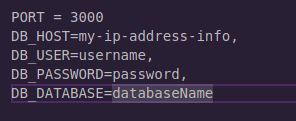
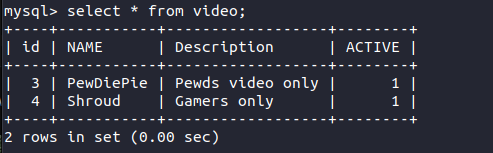
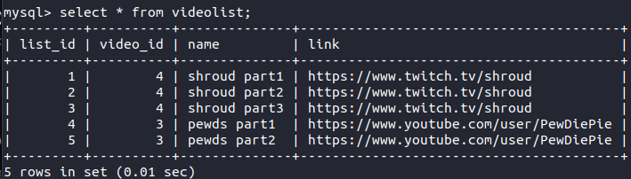
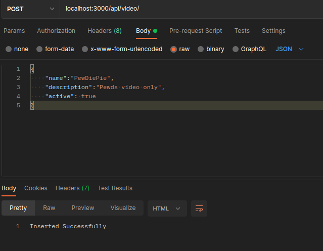
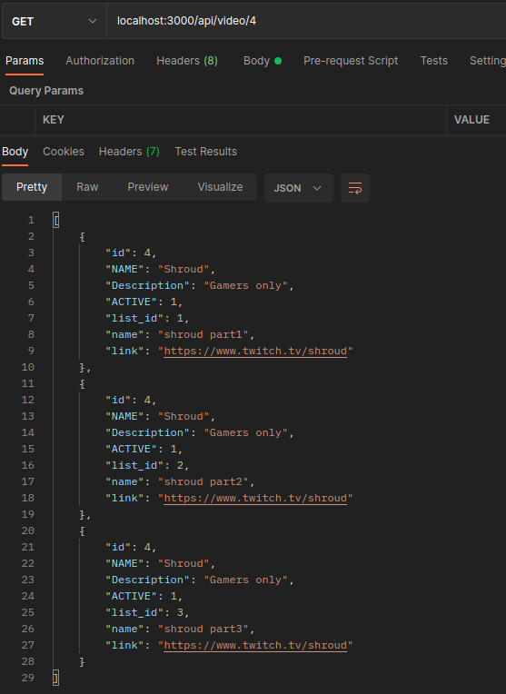
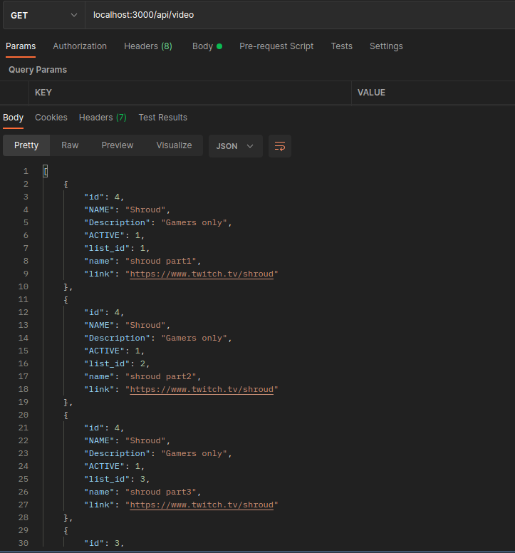
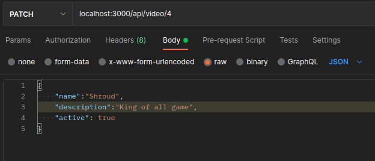
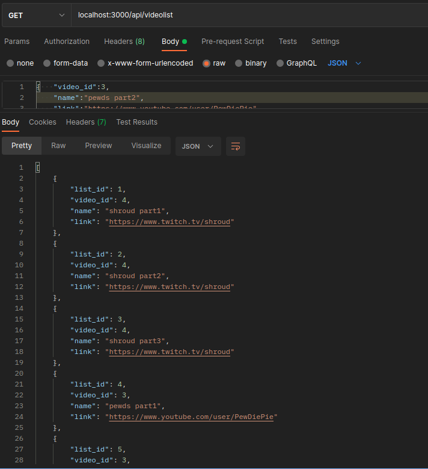
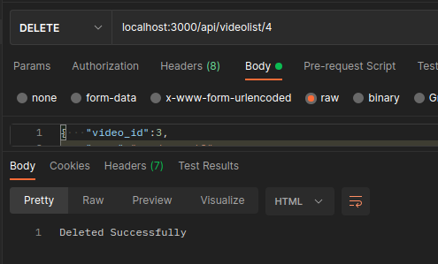

# AVO_VIDEO_API using MySQL

## ** IMP: In order to run the project, setup .env **

## Tables:

### Video Table:

  

### VideoList Table:

 

## API: -

### 1.&nbsp;&nbsp; [POST] &nbsp;&nbsp;&nbsp;/api/video

- Inserts data into video table

### 2.&nbsp;&nbsp; [GET] &nbsp;&nbsp;&nbsp;/api/video

- Returns object(video inner join videolist)

### 3.&nbsp;&nbsp; [GET] &nbsp;&nbsp;&nbsp;/api/video/:id

- Returns object(video inner join videolist where id=id)

### 4.&nbsp;&nbsp; [GET] &nbsp;&nbsp;&nbsp;/api/videos

- Returns data of video table

### 5.&nbsp;&nbsp; [PATCH] &nbsp;&nbsp;&nbsp;/api/video/:id

- Updates data with id=id of video table

### 6.&nbsp;&nbsp; [DELETE] &nbsp;&nbsp;&nbsp;/api/video/:id

- Deletes data with id=id of video table

### 7.&nbsp;&nbsp; [POST] &nbsp;&nbsp;&nbsp;/api/videolist

- Inserts data into videolist table

### 8.&nbsp;&nbsp; [GET] &nbsp;&nbsp;&nbsp;/api/videolist

- Returns all data of videolist

### 9.&nbsp;&nbsp; [GET] &nbsp;&nbsp;&nbsp;/api/videolist/:id

- Returns data of videolist table with list_id=id

### 10.&nbsp;&nbsp; [PATCH] &nbsp;&nbsp;&nbsp;/api/videolist/:id

- Updates data with list_id=id of videolist table

### 11.&nbsp;&nbsp; [DELETE] &nbsp;&nbsp;&nbsp;/api/videolist/:id

- Deletes data with list_id=id of videolist table  

## Images:

### POST Operation in video table:

  

### GET Operation in video table by id:

  

### GET Operation in video table:

  

### Patch Operation in video table:

  

### GET Operation in videolist table by id:

  

### DELETE Operation in video table:

